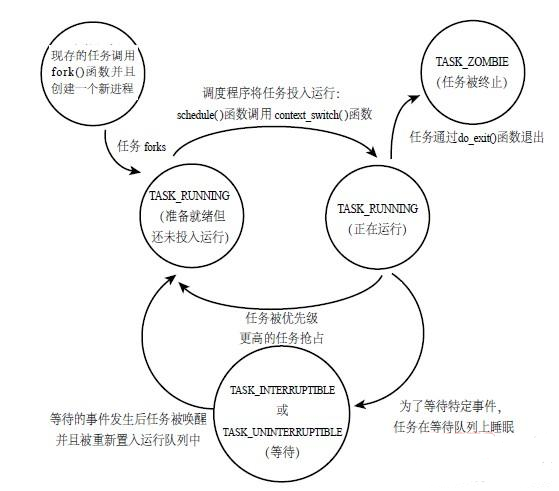
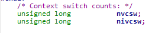

### 实验报告

#### 哲学家就餐问题

此实验的思想使用的是书上191页通过管程的实现，但是使用的是pthread中的互斥锁与条件变量来实现互斥与同步：

通过make dph可以得到相应的可执行文件：


之后运行查看结果：


#### 生产者消费者问题

使用make all命令可以得到所有可执行文件：


使用make prod和make cons可得到单独的可执行文件：


之后执行生产者和消费者，参数不同分为三组，分别如下：


./prod 10                                                                                 ./cons 1


./prod 5                                                                              ./cons 5


./prod 1                                                                             ./cons 10

可以简单发现一些规律：

①第一组，prod参数比较大，生产的领先消费的很多，生产出来的要过挺久一段时间才能被消费

②第二组， 两者参数相同，发现很好的同步，基本上生产出来的就能被立即消费，延时很低。

③第三组，cons参数比较大，发现消费很快，但是生产的很慢，消费者需要等着消费者生产，之后立即消费掉。


#### Linux内核试验

##### a)

- Linux进程的基本结构、状态设置。

进程，抽象点说是出于执行期的程序和它相关资源的总称；通俗点讲就是程序执行的实时结果，这个结果包括很多资源和状态，比如：`可执行代码段`，`数据段`，`打开的文件`，`挂起的信号`，`内核的内部数据`，`处理器状态`等。Linux为了便于管理所有这些细节，在内核中使用task_struct结构体来记录一个进程的各种信息，也就是下面要用到的很重要的一个结构体。有一个很重要的概念：进程描述符，就是这个结构体的实例。

进程的内存布局；每个进程所分配的内存由很多部分组成，叫做段segment，主要有：**文本段**，**初始化数据段**，**末初始化数据段**，**栈**，**堆**。

主要关系可见下图：


进程状态：

直观的看可用下图表示：



具体的状态有：

**R**：TASK_RUNNING，可执行状态； 

**S**：TASK_INTERRUPTIBLE，可中断的睡眠状态；

**D**：TASK_UNINTERRUPTIBLE，不可中断的睡眠状态；

**T**：TASK_STOPPED or TASK_TRACED，暂停状态或跟踪状态

**Z**：TASK_DEAD-EXIT_ZOMBIE，退出状态，进程成为僵尸进程

**X**：TASK_DEAD-EXIT_DEAD，退出状态，进程即将被销毁


- CPU调度基本架构

1. 基本概念：cpu调度的目的是让操作系统始终在执行进程，最大化利用率：每当一个进程因等待挂起或结束，则应调度另一个进程执行。

2. 调度的度量指标：

   - CPU利用率：实际系统一般保持在40(较轻负载)-90(重负载)
   - 吞吐量：单位时间内完成进程的数量，和进程本身也相关
   - 进程总耗时：从提交任务到完成的时间，包括等待载入内存、就绪等待、cpu周期、IO周期。
   - 进程等待时间：进程在就绪队列里的总耗时
   - 响应时间：交互式系统下熊进程起到**首次开始**响应用户的时间

3. CPU调度总的原则是：在单位时间内，尽可能提升CPU利用率和吞吐量，尽可能降低进程总耗时、进程等待时间以及响应时间。可能有时候对于不同目标，可能要适当忽略或添加一些待考虑项。

4. 常用的调度算法：

   先来先服务(FCFS)、最短运行时间优先(SJF)、优先级调度、轮转调度(RR)、基于优先级的轮转调度、多层队列调度、多层反馈队列调度等

5. 目前Linux主要使用的是CFS调度->完全公平调度算法：

   CFS背后的设定是， 每个进程默认都能从cpu分到相同的占用比例，可以设定优先级（nice value（nice值））调整相对比例。

   为了体现公平， 每个进程在一个目标周期内都至少能执行一次（如果进程太多可以调大周期防止切换太多），各执行占比从此周期分配。

    CFS没有定义明确的时间片和优先级，但是会为每个进程记录一个虚拟运行时间vruntime，该值和实际执行的关系与nice value相关。

   调度是抢占式的，调度器调度时每次都选择**vruntime最小**的进程。


- **CFS调度算法**：

  - 原理：
  
  CFS定义了一种新的模型，它给cf_rq（cfs的runqueue，cpu还有一个runqueue叫rq）中的每一个进程安排一个虚拟时钟：vruntime。如果一个进程得以运行，随着时间的累计，其进程的vruntime也会不断增大。没得到执行的进程的vruntime则不变。
  
  同样，像上面说的，调度器总会选择vruntime跑的最慢的那个进程来执行，就是所谓的“完全公平”。为了让优先级高的得到更多的运行，优先级低的往后稍稍，可以设置让优先级高的进程的vruntime增长的慢一点。以此得到更多的运行机会。
  
  - 基本设计思路

​		进程每次调度分配的运行时间为：`运行时间=调度周期*进程权重/所有进程权重之和`①。比如两个进程A，B，权重为1和2，调度周期为30ms， 则分配给A的时间为 30*1/3=10ms； 同样分配给B的为20ms。但是，vruntime并不直接等于运行时间，而是：

​		`vruntime = 实际运行时间 * 1024 /进程权重`②，公式②中的1024，实际上是nice值为0的进程的权重。也就是说所有进程都以nice为0的进程的权重1024作为基准，计算自己的vruntime增长速度。如果将公式②中的实际运行时间用公式①来代替，会得到：`vruntime = 调度周期 * 1024 / 所有进程总权重`③。于是可以看出来，对于不同进程，其vruntime增长大小应该是一样的，因为公式③中可以看出vruntime与进程个体没有关系。

​		那么就可以用这个vruntime来选择运行的进程，谁的vruntime比较小，就说明它之前占用的cpu的时间较短，那么就选择它来运行，那么就受到了**公平对待**。

​		CFS的思想就是让每个调度实体(sched_entity)的vruntime相互追赶，而**每个调度实体的vruntime增加速度是不同的**，权重越大的增加的越慢，原因同上

​		权重的理解：权重跟进程nice值(nice值表示进程的优先级)之前有一一对应的关系，可以在kernel/linux/sched/core.c中找到对应的定义：sched_prio_to_weight数组。nice值越大，权重越低。

```c
const int sched_prio_to_weight[40] = {
 /* -20 */     88761,     71755,     56483,     46273,     36291,
 /* -15 */     29154,     23254,     18705,     14949,     11916,
 /* -10 */      9548,      7620,      6100,      4904,      3906,
 /*  -5 */      3121,      2501,      1991,      1586,      1277,
 /*   0 */      1024,       820,       655,       526,       423,
 /*   5 */       335,       272,       215,       172,       137,
 /*  10 */       110,        87,        70,        56,        45,
 /*  15 */        36,        29,        23,        18,        15,
};
```

通过set_laod_weight函数对应，也在kernel/linux/sched/core.c中：

```c
static void set_load_weight(struct task_struct *p, bool update_load)
{
	int prio = p->static_prio - MAX_RT_PRIO;
	struct load_weight *load = &p->se.load;
	/*
	 * SCHED_IDLE tasks get minimal weight:
	 */
	if (task_has_idle_policy(p)) {
		load->weight = scale_load(WEIGHT_IDLEPRIO);
		load->inv_weight = WMULT_IDLEPRIO;
		p->se.runnable_weight = load->weight;
		return;
	}
	/*
	 * SCHED_OTHER tasks have to update their load when changing their
	 * weight
	 */
	if (update_load && p->sched_class == &fair_sched_class) {
		reweight_task(p, prio);
	} else {
		load->weight = scale_load(sched_prio_to_weight[prio]);
		load->inv_weight = sched_prio_to_wmult[prio];
		p->se.runnable_weight = load->weight;
	}
}
```


**重要的数据结构**

几个重要的数据结构：**task_struct**，**sched_entity**，**cfs_rq**，**rq**，task_struct代表一个进程；sched_entity是调度主体；

task_struct代表一个进程，包含进程的所有信息，主要的定义如下：

```c
struct task_struct {
	...
    
	int				on_rq;
	int				prio;
	int				static_prio;
	int				normal_prio;
	unsigned int			rt_priority;
	const struct sched_class	*sched_class;
	struct sched_entity		se;
	struct sched_rt_entity		rt;
	...
    /* Context switch counts: */
	unsigned long			nvcsw;
	unsigned long			nivcsw;
	...
```

sched_entity代表调度实体，用来跟踪进程进行记账，就是记录很多信息，位于include/linux/sched.h中：

```c
struct sched_entity {
	/* For load-balancing: */
	struct load_weight		load;
	unsigned long			runnable_weight;
	struct rb_node			run_node;
	struct list_head		group_node;
	unsigned int			on_rq;
	u64				exec_start;
	u64				sum_exec_runtime;
	u64				vruntime;
	u64				prev_sum_exec_runtime;
	u64				nr_migrations;
	struct sched_statistics		statistics;
#ifdef CONFIG_FAIR_GROUP_SCHED
	int				depth;
	struct sched_entity		*parent;
	/* rq on which this entity is (to be) queued: */
	struct cfs_rq			*cfs_rq;
	/* rq "owned" by this entity/group: */
	struct cfs_rq			*my_q;
#endif
#ifdef CONFIG_SMP
	/*annotation*/
	struct sched_avg		avg;
#endif
};
```

CFS调度队列：cfs_rq部分定义如下(位于kernel/sched/sched.h)：

```c
struct cfs_rq {
	struct load_weight	load;
	unsigned long		runnable_weight;
	unsigned int		nr_running;
	unsigned int		h_nr_running;
	u64			exec_clock;
	u64			min_vruntime;
#ifndef CONFIG_64BIT
	u64			min_vruntime_copy;
#endif
	struct rb_root_cached	tasks_timeline;
	/*
	 * 'curr' points to currently running entity on this cfs_rq.
	 * It is set to NULL otherwise (i.e when none are currently running).
	 */
	struct sched_entity	*curr;
	struct sched_entity	*next;
	struct sched_entity	*last;
	struct sched_entity	*skip;

    ...
```

CPU的调度队列：rq部分定义如下(位于kernel/sched/sched.h):

```c
struct rq {
	/* runqueue lock: */
	raw_spinlock_t		lock;
	/*
	 * nr_running and cpu_load should be in the same cacheline because
	 * remote CPUs use both these fields when doing load calculation.
	 */
	unsigned int		nr_running;
#ifdef CONFIG_NUMA_BALANCING
	unsigned int		nr_numa_running;
	unsigned int		nr_preferred_running;
	unsigned int		numa_migrate_on;
#endif
	#define CPU_LOAD_IDX_MAX 5
	unsigned long		cpu_load[CPU_LOAD_IDX_MAX];
#ifdef CONFIG_NO_HZ_COMMON
#ifdef CONFIG_SMP
	unsigned long		last_load_update_tick;
	unsigned long		last_blocked_load_update_tick;
	unsigned int		has_blocked_load;
#endif /* CONFIG_SMP */
	unsigned int		nohz_tick_stopped;
	atomic_t nohz_flags;
#endif /* CONFIG_NO_HZ_COMMON */
	/* capture load from *all* tasks on this CPU: */
	struct load_weight	load;
	unsigned long		nr_load_updates;
	u64			nr_switches;
	struct cfs_rq		cfs;
	struct rt_rq		rt;
	struct dl_rq		dl;
    ...
```

CFS通过调度实体sched_entity管理进程运行信息，决定是谁(vruntime增长小的)能够被调度，以及CFS_rq和rq对进程进行管理。


Q：简述进程优先级、nice值和权重之间的关系

A：就像上面提到的一点点一样。内核使用0~139的数值表示优先级，数值越低优先级越高。优先级0-99给实时进程使用，另外的给普通进程使用，在用户空间由一个传统的变量nice值映射到普通进程的优先级(100-139)。

​		进程默认的nice值为0。nice值为从-20-19(上面代码)，可以理解为40个等级，nice值越高，优先级越低。而且有：nice每变化1，则相应的进程获得CPU的时间就改变10%。

​		权重即为调度实体的权重，为了方便，约定nice值为0的权重值为1024，其他的nice值对应相应的权重值可以通过查表方式获取(上面贴出来的sched_prio_to_weight结构体的部分)。


Q：CFS调度器中的vruntime的基本思想是什么？是如何计算的？何时得到更新？其中的min_vruntime有什么作用？

A： a) 由上面的公式②③，知道vruntime使用来表示一个进程是否能被CPU调度的值，CPU倾向于调度vruntime较小的进程，通过vruntime就可以实现“完全公平”调度；

​		b) 计算公式：vruntime = 实际运行时间 * nice值对应的weight值 / 该进程的权重 (nice值对应的weight值可通过上面查表得到)；

​		c) 在创建新进程、加入就绪队列、调度tick等都会更新当前进程的vruntime值；

​		d) 由上面cfs_rq结构体可以看到有min_vruntime成员，单步递增，用于跟踪该就绪队列红黑树中最小的vruntime。


##### b)添加系统调用，显示信息

###### 需要先知道点什么

显示信息，显示哪些信息：按照作业要求的，需要知道sched_entity结构体下的一些数据，sched_avg结构体下的一些数据，还有就是nr_switches、nr_voluntary_switches和nr_involuntary_switches三个数据.

进程的各种信息是通过task_struct结构体存储的，搜索源码(include/linux/sched.h)可以看到task_struct的定义，前一部分如下：


可以看到其中包含一个sched_entity的结构体，叫做se，检索它，可以看到如下内容：


上面四个就是要展示的数据，下面还有一个结构体sched_avg，检索sched_avg可以看到定义：


可以看到后半段要显示的数据。

对于nr开头的三个数据，通过搜索资料发现，后两个分别表示**主动切换次数**和**被动切换次数**，nr_switches为总的切换次数，即两者的和。而后两个就定义在task_struct结构体中，不过隐藏的很深：



还有一个se.load.weight是在load_weight结构体中，在sched_entity中也有引用，为load，对应上面sched_entity图中第一个红框，且load_weight的定义为：


系统调用时，会有一个全局变量current指向当前进程的信息，即task_struct，可以通过current->nvcsw等得到那三个以nr开头的数据，通过current->se.可以得到sched_entity下的数据，通过current->se.avg.可以得到sched_avg下的数据，weight同样也可通过current->se.load.weight。

之后只需要在自己设定的系统调用函数中printk即可在dmesg中显示对应的信息。sys.c中添加的代码大致如下：

```c
SYSCALL_DEFINE0(mycall){
        printk("Hello, this is my syscall: mycall!!\n");
        printk("-------------------------------------------------\n");
        printk("se.exec_start\t\t:\t%llu\n", (current -> se).exec_start);
        printk("se.vruntime\t\t:\t%llu\n", (current -> se).vruntime);
        printk("se.sum_exec_runtime\t\t:\t%llu\n", (current -> se).sum_exec_runtime);
        printk("se.nr_migrations\t\t:\t%llu\n", (current -> se).nr_migrations);
        printk("nr_switches\t\t:\t%lu\n", current->nvcsw + current->nivcsw);
        printk("nr_voluntary_switches\t\t:\t%lu\n", current->nvcsw);
        printk("nr_involuntary_switches\t\t:\t%lu\n", current->nivcsw);
        printk("se.avg.load_sum\t\t:\t%llu\n", current->se.avg.load_sum);
        printk("se.avg.util_sum\t\t:\t%u\n", current->se.avg.util_sum);
        printk("se.avg.load_avg\t\t:\t%lu\n", current->se.avg.load_avg);
        printk("se.avg.util_avg\t\t:\t%lu\n", current->se.avg.util_avg);
        printk("se.avg.last_update_time\t\t:\t%llu\n", current->se.avg.last_update_time);
        printk("se.load.weight\t\t:\t%lu\n", (current -> se).load.weight);

        return 0;

}
```

之后就 make meproper；make clean； make menuconfig；make；make modules_install；make install；最后重启(说着简单，中间出了好多次错误)，通过uname -a命令可以看到已经成功切换内核版本，通过screenfetch命令得到结果如下：


之后编写mycall.c，通过make mycall编译后运行，通过dmesg查看打印信息：


于是成功调用了系统调用(不要在意排版)。

