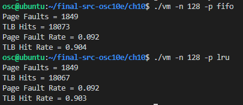

# 大作业2实验报告

## 虚存管理模拟程序

### 1 Virtual Manager

先编译运行一下vm.c (中间版本，最终的结果: vm.c运行时是用的./vm -n 128 -p lru之类的)：编译之后运行，使用**./vm addresses.txt**，结果如下：


之后使用test.sh进行测试，因为测试时使用的是argv[1]为addresses.txt，所以对test.sh进行了简单修改，如下：

```sh
#!/bin/bash -e
echo "Compiling"
gcc vm.c -o vm
echo "Running vm"
./vm addresses.txt > out.txt    # change
echo "Comparing with correct.txt"
diff out.txt correct.txt
echo "Compare Complete"
```

**实验是在虚拟机中进行的，但是correct.txt使用的是老师发的版本，不是虚拟机中给的**

运行test.sh需要给予权限，使用如下命令即可：

```sh
chmod a+x test.sh
```

之后运行 **./test.sh** 即可：


发现只有最后一行的TLB Hits不一样，一个是54，correct给的是55，不知道什么原因，不过我TLB使用LRU时得到的TLB Hits是55。

**实现LRU的TLB和LRU的页面置换**

最终代码见vm.c，编译运行即可查看对应结果，记得将addresses.txt和BACKING_STORE.bin放到同目录下，这里参数中不用带addresses.txt，样例：**./vm -n 256 -p lru**。**不输入参数则默认-n = 256， -p = fifo** 。为了显示运行的命令和对应结果，将打印物理内存中的值的部分注释掉了，最后结果分别如下： 

- number of physical frame: 256, policy: fifo:

  

- number of physical frame: 256, policy: lru:

  

- number of physical frame: 128, policy: fifo:

  

- number of physical frame: 128, policu: lru:

  

### 2 Trace测试

生成addresses-locality.txt的程序见trace.c，主要想法是创建指定长度的双向链表，期间得到各个节点的上一个和下一个节点的地址保存起来，最后生成含有20000条地址的txt文件，然后通过trace.py绘制访问轨迹图。其实trace.py还有一个功能，是读取trace.c得到的数据，并将它们随机打乱保存到addresses-localityShuffle.txt文件中，因为是想进行其他的测试，具体见trace.py的注释信息。下面再说：

先通过trace.c生成2w条条目，具体见addresses-locality.txt，放到虚拟机代码中测试，得到结果如下：



通过trace.py绘制**页码-时间**图(时间是用range(len(ans))代表的)，得到图像如下：


诶，图像看起来好像挺对的，但是从上面那个图中可以看到无论是fifo还是lru，TLB Hits都比较高，而且fifo的甚至比lru的还要多，这个数据就感觉不能体现lru的优势啊，不能体现内存访问的局部性。可能是因为生成的地址就是按顺序摆放的？

于是试着打乱得到的地址数据，使用trace.py文件，得到打乱的addresses-localityShuffle.txt，放进去再次测试，得到的结果为：


得到的结果跟最上面1000个条目的时候的比例很像，可是lru的还是比fifo的低一点点，还是不能说明内存访问的局限性啊，按理说lru应该比fifo效果好很多。使用trace.py画一下图看看：


emmm，有点无厘头，好像还不如上面不打乱的图看起来正经。

之前试了挺多其他方法，比如增多地址条目、通过得到随机数的地址、还有按时间得到的随机数的地址，发现通过随机生成的变量的地址完全不够有代表性，之后才用上面的生成链表的形式得到地址，结果也不太行。至少生成条目并且测试了。

## Linux内存管理实验

###1 内核代码阅读 与 分析图1

阅读内核代码版本为4.18.20，见 https://elixir.bootlin.com/linux/v4.18.20/source 。主要的结构体以及对应的定义位置分别如下：

- task_struct: /include/linux/sched.h (line: 593)

- mm_struct: /include/linux/mm_types.h (line: 340)
- vm_area_struct /include/linux/mm_types.h (line: 264)
- vm_operations_struct /include/linux/mm.h (line: 393)
- page  /include/linux/mm_types (line: 70)

1. task_struct，跟之前所述的一样，记录一个进程的所有信息，其中引用了结构体mm_struct，即内存管理信息，一个进程的内存管理信息主要包含在此结构体中，在task_struct中的定义为：

   ```c
   struct task_struct {
   	...
           
   	struct mm_struct		*mm;    /*here，mm为此进程的内存管理信息的实例*/
   	struct mm_struct		*active_mm;
   
       ...
   }
   ```

   task_struct代表一个进程，此进程中的***mm**(mm_struct)则包括此进程的所使用的内存的管理信息。

2. 通过task_struct导向mm_struct，下面看这个很重要的结构体。

   ---

   **首先**，mm_struct中定义了进程地址空间的布局，通俗点说就是设定了数据段，代码段，堆，栈的位置信息，下面也会有实验对此部分进行展示。对地址空间布局的管理主要通过结构体中以下变量实现：

   ```c
   struct mm_struct {
   	...
       unsigned long mmap_base;
       // 表示虚拟地址空间中用于内存映射的真实地址
       ...
       unsigned long task_size;
       // 存储了对应进程的地址空间长度
       ...
   	unsigned long start_code, end_code, start_data, end_data;
   	/* start_code: 可执行代码的起始地址
   	 * end_code: 可执行代码的最后地址
   	 * start_data: 已初始化数据的起始地址
   	 * end_data: 已初始化数据的最后地址
   	 */
       
   	unsigned long start_brk, brk, start_stack;
       /* start_brk: 堆的起始位置
        * brk: 堆区域当前结束的地址
        * 堆的起始地址在进程生命周期中不变，但其长度会变化，意味着brk的值会变化
        * start_stack: 用户堆栈的起始地址
        */
       
   	unsigned long arg_start, arg_end, env_start, env_end;
       /* arg_start: 命令行参数的起始地址
        * arg_end: 命令行参数的起始地址
        * env_start: 环境变量的起始地址
        * env_end: 环境变量的最后地址
        */
   	...
   }
   ```

   mm_struct主要就是通过这几个unsigned long来记录各个数据所在的位置以及空间的大小的。详细说明在面代码的注释部分。下图也可直观的描述这些变量：

   

   ---

   **其次**，mm_struct中还有一个比较重要的成员：**vm_area_struct**:

   vm_area_struct是虚拟内存管理的最基本的管理单元，它描述的是一段连续的、具有相同访问属性的虚拟内存空间，该虚拟内存空间的大小为物理内存页面的整数倍。通常进程所使用到的虚存空间不连续，且各部分虚存空间的访问属性也可能不同，所以一个进程的虚存空间需要多个vm_area_struct结构来描述。每个虚拟内存区域都是vm_area_struct的一个实例(像图1中的中间下方右侧)，vm_area_struct结构体的定义为：

   ```c
   struct vm_area_struct {
   	
   	unsigned long vm_start;		/* 该区域在用户空间中的起始地址*/
   	unsigned long vm_end;		/* 该区域在空户空间中的结束地址*/
   
   	struct vm_area_struct *vm_next, *vm_prev; //双向链表
   
   	struct rb_node vm_rb;  /*进程所有vm_area_struct实例的红黑树集成*/
       ...
   	struct mm_struct *vm_mm;	//反向指针，指向该区域所属的mm_struct实例
   	...
       unsigned long vm_flags;		/* 保存了进程对该虚存空间的访问权限*/
       
   	/* 指向多个方法的集合，用于对此vm_area_struct的各种操作 */
   	const struct vm_operations_struct *vm_ops;
   
   	/* Information about our backing store: */
   	unsigned long vm_pgoff;		/* Offset (within vm_file) in PAGE_SIZE units */
   	struct file * vm_file;		/* File we map to (can be NULL). */
   	void * vm_private_data;		/* was vm_pte (shared mem) */
   	...
   }
   ```

   进程建立vm_area_struct结构后，只是说明进程可以访问这个虚存空间，但有可能还没有分配相应的物理页面并建立好页面映射。若是进程执行中有指令需要访问该虚存空间中的内存，便会产生一次缺页异常。这时候，就需要通过vm_area_struct结构中的vm_ops(vm_operations_struct)对此vm_area_struct进行相应操作。

   vm_area_struct对应用户空间虚拟内存的一个个区域的实例：

   

   ---

3. 上面提到vm_operations_struct中定义的是对vm_area_struct的一组操作，下面看vm_operations_struct结构体，定义如下：

   ```c
   struct vm_operations_struct {
      void (*open)(struct vm_area_struct * area); /* 打开VMA(vm_area_struct)*/
      void (*close)(struct vm_area_struct * area);  /* 关闭VMA*/
      struct page * (*nopage)(struct vm_area_struct * area, unsigned long address, int *type); /*访问的页不在内存时调用，添加上映射*/
      int (*populate)(struct vm_area_struct * area, unsigned long address, unsigned long len, pgprot_t prot, unsigned long pgoff, int nonblock); 
       ...
   };
   ```

   还有其他比如split，mremap等函数，不再列出，最常用的应该是nopage函数，当访问的页不在内存中时调用此函数，将对应的页加到内存上。

   ---

4. 内核会为每一个物理页帧创建一个struct page的结构体，此要保证page结构体足够的小，否则仅struct page就要占用大量的内存。page结构体的数据结构如下：

   ```c
   struct page {
   	unsigned long flags;		/* Atomic flags, some possibly
   					 * updated asynchronously */
   	/*...*/
   	union {
   		struct {	/* Page cache and anonymous pages */
   			/*...*/
   			struct list_head lru;
   			/* See page-flags.h for PAGE_MAPPING_FLAGS */
   			struct address_space *mapping;
   			pgoff_t index;		/* Our offset within mapping. */
   			/*...*/
   			unsigned long private;
   		};
   		struct {	/* slab, slob and slub */
   			union {
   				struct list_head slab_list;	/* uses lru */
   				struct {	/* Partial pages */
   					struct page *next;
   #ifdef CONFIG_64BIT
   					int pages;	/* Nr of pages left */
   					int pobjects;	/* Approximate count */
   #else
   					short int pages;
   					short int pobjects;
   #endif
   				};
   			};
   			struct kmem_cache *slab_cache; /* not slob */
   			/* Double-word boundary */
   			void *freelist;		/* first free object */
   			...
   		};
   		...
           ...
   	...
       ...
   }
   ```

   为了节省内存，struct page中使用了大量的联合体union。上面略去了大部分内容，具体见源码，下面说一些重要的数据：

   - **flags**， 描述page的状态和其他信息，定义在/include/linux/page-flags.h中，简单列举如下：

     ```c
     enum pageflags {
     	PG_locked,   /*page被锁定，说明有使用者正在操作该page。*/
     	PG_error,    /*状态标志，表示涉及该page的IO操作发生了错误。*/
     	PG_referenced,   /*表示page刚刚被访问过。*/
     	PG_uptodate,     /*表示page的数据已经与后备存储器是同步的，是最新的。*/
     	PG_dirty,       /*与后备存储器中的数据相比，该page的内容已经被修改。*/
     	PG_lru,         /*表示该page处于LRU链表上。*/
     	PG_slab,         /*该page属于slab分配器。*/
     	PG_reserved,      /*设置该标志，防止该page被交换到swap。*/
     	PG_private,		   /*如果page中的private成员非空，则需要设置该标志。*/
     	PG_writeback,		/* page中的数据正在被回写到后备存储器。 */
     	PG_mappedtodisk,	/* 表示page中的数据在后备存储器中有对应。 */
     	PG_reclaim,		  /* 表示该page要被回收。当PFRA决定要回收某个page后，需要设置该标志。 */
     	PG_swapbacked,		/*该page的后备存储器是swap。 */
     	PG_unevictable,	  /*该page被锁住，不能交换，并会出现在LRU_UNEVICTABLE链表中，它包括的几                         种page：ramdisk或ramfs使用的页、shm_locked、mlock锁定的页*/
         ...
     }
     ```

   - **_count**:  引用计数，表示内核中引用该page的次数，如果要操作该page，引用计数会+1，操作完成-1。当该值为0时，表示没有引用该page的位置，所以该page可以被解除映射，这往往在内存回收时是有用的。

   - **_mapcount**: 被页表映射的次数，也就是说该page同时被多少个进程共享。初始值为-1，如果只被一个进程的页表映射了，该值为0 。如果该page处于伙伴系统中，该值为PAGE_BUDDY_MAPCOUNT_VALUE（-128），内核通过判断该值是否为PAGE_BUDDY_MAPCOUNT_VALUE来确定该page是否属于伙伴系统。

     **注意区分 \_count和\_mapcount，\_mapcount表示的是映射次数，而_count表示的是使用次数；被映射了不一定在使用，但要使用必须先映射。**

   - **mapping**: 

     - 如果mapping = 0，说明该page属于交换缓存（swap cache）；当需要使用地址空间时会指定交换分区的地址空间swapper_space。
     -  如果mapping != 0，bit[0] = 0，说明该page属于页缓存或文件映射，mapping指向文件的地址空间address_space。
     - 如果mapping != 0，bit[0] != 0，说明该page为匿名映射，mapping指向struct anon_vma对象。

   - **index**: 在映射的虚拟空间内的偏移；一个文件可能只映射一部分，假设映射了1M的空间，index指的是在1M空间内的偏移，而不是在整个文件内的偏移。

   - **private**: 私有数据指针，由应用场景确定其具体的含义:

     - 如果设置了PG_private标志(上面的flags)，表示buffer_heads；
     - 如果设置了PG_swapcache标志，private存储了该page在交换分区中对应的位置信息swp_entry_t。
     - 如果_mapcount = PAGE_BUDDY_MAPCOUNT_VALUE，说明该page位于伙伴系统，private存储该伙伴的阶。

   - **lru**: 链表头，主要有3个用途:
     - page处于伙伴系统中(后面有介绍)时，用于链接相同阶的伙伴（只使用伙伴中的第一个page的lru即可达到目的）。
     - page属于slab时，page->lru.next指向page驻留的的缓存的管理结构，page->lru.prec指向保存该page的slab的管理结构。
     - page被用户态使用或被当做页缓存使用时，用于将该page连入zone中相应的lru链表，供内存回收时使用。

---

对图1的分析说明：

先看右侧的4G的虚拟内存空间：

Linux 的虚拟地址空间为0～4G 字节。Linux 内核将这4G 字节的空间分为两部分。将最高的1G 字节（从虚拟地址0xC0000000 到0xFFFFFFFF），供内核使用，称为“内核空间”。而将较低的3G 字节（从虚拟地址0x00000000 到0xBFFFFFFF），供各个进程使用，称为“用户空间”。因为每个进程可以通过系统调用进入内核，因此，Linux 内核由系统内的所有进程共享。于是，从具体进程的角度来看，每个进程可以拥有4G 字节的虚拟空间。见如下两张图：


Linux 使用两级保护机制：0 级供内核使用，3 级供用户程序使用。从上图可以看出，每个进程有各自的私有用户空间（0～3G），这个空间对系统中的其他进程是不可见的。最高的1G 字节虚拟内核空间则为所有进程以及内核所共享。从第一张图可以看到用户空间中对应多个用户进程线性区，也是对应多个虚拟地址空间vm_area_struct。下面还会提到。

之后看最下面：


进程信息task_struct通过mm的指针指向mm_struct结构体，此为内存管理的一个重要的结构体：


往右通过一个名为mmap的vm_area_struct的结构体得到用户线程区的虚拟地址，用户线程区的虚拟地址通过页表算法得到用户线性地址，包括页目录偏移量、页表偏移量和物理页偏移量(应该使用的是二级页表，页目录偏移量和页表偏移量确定页码，加上物理页偏移量得到物理内存)。

往左*pgd(page directory)指向的CR3寄存器中存储的页目录(页目录)，即：


得到用户线性地址(页目录偏移量、页表偏移量和物理页偏移量)之后将页目录偏移量和页表偏移量通过虚线往左看：**页目录偏移量与CR3中存储的页目录得到物理基地址，此物理基地址与页表偏移量可以得到物理内存中的基地址，再加上用户线性地址中的物理页偏移量即可得到最后的物理地址**，可以看如下箭头(1, 1, 2, 2, 3, 3)：


---

下面看文档中图1中的中上部分：


Linux内核管理物理内存是通过分页机制实现的，它将整个内存划分成无数个4k(也可能其他大小，这里是i386体系结构)大小的页，从而分配和回收内存的基本单位便是内存页。利用分页管理有助于灵活分配内存地址，因为分配时不必要求必须有大块的连续内存，系统可以东一页、西一页的凑出所需要的内存供进程使用。虽然如此，但是实际上系统使用内存时还是倾向于分配连续的内存块，因为分配连续内存时，页表不需要更改，因此能降低TLB的刷新率（频繁刷新会在很大程度上降低访问速度）。**伙伴系统**就是尽量分配连续内存的一种很好的方法：

*( 另外,需要提及的是，物理页在系统中由页结构struct page描述，系统中所有的页面都存储在数组**mem_map[]**中，可以通过该数组找到系统中的每一页(空闲或非空闲))*

伙伴系统的宗旨是用最小的内存块来满足内核的对于内存的请求。 假如为1M大小，而允许的最小块为64K，那么当我们申请一块200K大小的内存时，就要先将1M的块分裂成两等分，各为512K，这两分之间的关系就称为伙伴，然后再将第一个512K的内存块分裂成两等分，各位256K，将第一个256K的内存块分配给内存，这样就是一个分配的过程。 下面用图演示二分的过程，这里最小单元是64k：


就这样类似上图的方法不断二分，上上图中最右侧就已经分成一个个4k小的页了，从左到右的箭头可以看出来分成一个个小的页的过程。

其中896M以下的物理内存给用户使用，就像上面说的通过页目录偏移量、页表偏移量和物理页偏移量得到的物理内存就在这个范围内，而896M以上的高端内存给内核线性地址用（包括**固定映射的线性地址**、**永久内核映射**和**由vm_truct管理的vmalloc分配的虚拟内存**），具体过程可看图中对应的绿色和蓝色的两条线：**通过CR3中的进程页目录中的内核页目录得到内核页表，加上偏移量映射到二级内核页表，最后再通过不同偏移量映射到不同的物理空间**，见如下箭头(1, 1, 2, 2, 3, 3)：


对于内核空间的下面部分（内核数据，内核代码等）,线性地址减去page_offset偏移量直接转换成物理地址，不需要二级内核页表，从上图的下半部分也可以看出，从CR3中的进程页目录中的内核页目录中得到内核页表，加上(减去)偏移量之后直接得到物理地址，箭头1, 2, 3：


---

虽然稍微有点乱，不过对应的区域跟箭头都解释了。

###2 分析图2，解释接口kmalloc，vmalloc，__get_free_pages

从图中可以看到vmalloc和kmalloc都直接作用于内核虚拟内存，但是vmalloc是通过结构体vm_struct分配，而kmalloc直接作用于内核虚拟内存的物理内存映射区，最后通过get_free_pages分配到物理内存，于是可以猜测如下区别：

- 在内核空间中调用kmalloc()分配连续的物理内存，分配速度比较快，而调用vmalloc()分配的是不连续的物理内存。
- kmalloc()分配保证在物理内存中是连续的，但是能够分配的空间比较少；vmalloc分配保证的是在虚拟地址空间上是连续的，但在物理内存中分配到的地址是非连续的，不过分配的空间较大。
- kmalloc分配内存是基于slab的，因此slab的一些比如着色，对齐等都具备，性能较好，物理地址和逻辑地址都是连续的。
- __get_free_pages()申请的内存是一整页的，一页的大小一般为128k，直接位于物理内存上，并且是连续的，与真实的物理地址只有一个固定的偏移，存在较简单的线性转换关系，从图中可以看出来get_free_pages()一般用来帮助malloc， kmalloc，vmalloc获得物理内存的页空间。

### 3 mtest.c测试

程序见mtest.c，在测试堆的地址的地方使用的是malloc分配的内存，没有使用例程中的bsrk函数；同时在最开始还打印了三个外部整型变量etext, edata, end的地址，运行./mtest，可以得到如下结果：


代码段、数据段、BSS、栈、堆相关地址分别见**Function Location、DATA Location、BSS Location、Stack&p, heap, bheap、Heap Location**。

### 4  分析mtest各个内存段

代码中main函数最后添加sleep(60000);，让其运行之后睡一分钟，从下图左上角可以看到进程id是3436，在新终端中运行cat /proc/3436/maps可以看到如下信息：


简单对应了一下。先对**每列**进行说明：

| 列                              | 说明                                                         |
| ------------------------------- | ------------------------------------------------------------ |
| 第一列(如 5612e.....-5612e....) | 前半部分为vm_start，后半部分为vm_end, 分别为虚拟内存空间的起始与终止位置。 |
| 第二列(如 rw-p)                 | 操作权限，r为读，w为写，x为可执行， p为私有，对应vm_area_struct结构体中的unsigned long vm_flags |
| 第三列(如 001e7000)             | 针对有名映射，指本段映射地址在文件中的偏移，对应结构体中的unsigned long vm_pgoff，对于匿名映射，则为vm_start |
| 第四列(如 08:01)                | 所映射的文件所属设备的设备号，08为主设备号，00为次设备号     |
| 第五列(如 22179)                | 文件的索引节点号， 与ls -i显示的内容相同                     |
| 第六列(如 [heap])               | 所映射的文件名。对有名映射而言，是映射的文件名，对匿名映射来说，是此段内存在进程中的作用。[stack]表示本段内存作为栈来使用，[heap]作为堆来使用，其他情况则为无。 |

对**主要行**的说明：

| 行                                            | 说明                                                         |
| --------------------------------------------- | ------------------------------------------------------------ |
| 前三行(/home/osc/final-src-osc10e/ch10/mtest) | 第一行只读可执行，刚好对应两个函数对应的地方main和aFunction函数，为代码段；第二行只读，不可执行，对应的是定义的bss跟data两个没有修改的变量，为数据段；第三行可读可写，存放的是aFunction函数中的静态变量level，也为数据段。 |
| 第四行([heap])                                | 顾名思义，为堆，存放的是通过malloc分配的两个变量heap和nheap。 |
| libc-2.27.so行                                | 是libc-2.27共享库在maps文件中的记录，每个共享库在maps文件中对应着4行，数据段，代码段，堆和栈。 |
| [stack]                                       | 字面意思，栈，主要存放的是函数中的临时变量和通过alloca分配的变量。图中也有对应。 |

### 5 简答

- 1，brk/sbrk， mmap的区别，分别什么时候用？

  都是给malloc函数分别内存的底层函数。

  **主要区别**：brk/sbrk是将数据段(.data)的最高地址指针_edata往高地址推；mmap是在进程的虚拟地址空间中（堆和栈中间，称为文件映射区域的地方）找一块空闲的虚拟内存。

  **细节部分**：

  - **brk/sbrk**：

    函数原型：

    ```c
    #include <unistd.h>  //在此头文件中
    int brk(void * addr); 
    void * sbrk(intptr_t increment);
    ```

    介绍：brk()和sbrk()可以改变程序间断点的位置。通过增加程序间断点进程可以更有效的申请内存 。当addr参数合理、系统有足够的内存并且不超过最大值时brk()函数将数据段结尾设置为addr,即间断点设置为addr。sbrk()将程序数据空间增加increment字节。当increment为0时则返回程序间断点的当前位置。两个函数都用来改变“Program Breakpoint”的位置，改变数据段长度（Change data segment size），实现虚拟内存到物理内存的映射。

    主要用在：当malloc小于128k的内存时，使用brk分配内存，将_edata往高地址推。此时只分配虚拟空间，没有映射到物理内存，只有当第一次读/写的时候，引起缺页错误之后才会建立映射关系。

  - **mmap**：

    函数原型：

    ```c
    #incldue<sys/mman.h>
    void * mmap(void * addr, size_t length,int prot,int flags,int fd,off_t offset);
    ```

    介绍：

    - addr：起始地址，置零让系统自行选择并返回即可.
    - length： 长度，不够一页会自动凑够一页的整数倍，可以宏定义#define MIN_LENGTH_MMAP 4096为一页大小 
    - prot：读写操作权限，PROT_READ可读、PROT_WRITE可写、PROT_EXEC可执行、PROT_NONE映射区域不能读取。
    - flags：
      - MAP_SHARED [share this mapping]、MAP_PRIVATE [Create a private copy-on-write mapping] MAP_SHARED只能设置文件共享，不能地址共享，即使设置了共享，对于两个进程来说，也不会生效。而MAP_PRIVATE则对于文件与内存都可以设置为私有。
      - MAP_ANON【Deprecated】、MAP_ANONYMOUS：匿名映射，如果映射地址需要加该参数，如果不加默认映射文件。MAP_ANON已经过时，只需使用MAP_ANONYMOUS即可。
    - 文件描述符fd & 文件描述符偏移量offset：fd和offset对于一般性内存分配来说设置为0即可

    主要用在：当malloc大于128k的内存时，使用mmap分配内存，在堆和栈之间找一块空闲内存分配(对应独立内存，而且初始化为0)。默认情况下，malloc函数分配内存，如果请求内存大于128K（可由M_MMAP_THRESHOLD选项调节），那就不用推_edata指针，而是利用mmap系统调用，从堆和栈的中间分配一块虚拟内存。

- 2，为什么不用系统调用？malloc做了哪些额外的工作？

  ①便利性方面：mmap这类的系统调用是为了方便应用使用操作系统的接口，而malloc这类的C语言库函数是为了方便人们编写应用程序，对于实际编写应用程序来说，使用malloc这类库函数更符合方便。使用系统调用则需要深入系统调用的接口，增大编程难度。

  ②安全性方面：如果滥用系统调用很有可能引起系统崩溃，比如某个人接口参数写错等等，而malloc这类库函数则是间接使用系统调用，安全性和权限方面比较好。

  额外工作：我觉得malloc主要做的额外工作主要是很好的把控系统调用，可以根据分配的大小选择不同的策略进行分配，提高效率与安全性，并且封装起来，便于开发者编程。

- 3，malloc分配的是虚拟内存还是物理内存，怎么映射？

  通过上面说到的图2可以看出，通过malloc分配的是**虚拟内存**，虚拟内存与物理内存之间通过MMU(内存管理单元)映射，可以通过页表，TLB等方式进行映射，图2中展示的就是通过__get_free_pages得到页表进行映射。

### 6 附加题

代码见myalloc.c文件，两个函数分别为myalloc函数和myfree函数，简单的测试内容放在main函数中，类似上面第三题，通过我创建的myalloc函数分配一个64字节的空间，之后用两个指针指向其开头和结尾，最后打印出来结果，如下：


发现两个地址值差值为十六进制的40，刚好为4*16 = 64字节，跟如下测试代码一致：

```c
char *testp;
    testp = (char*)myalloc(64 * sizeof(char));
    printf("\nStart of heap 'testp': %p\n", testp);
    printf("End of heap 'testp': %p\n", testp + 64 * sizeof(char));
```

因为程序以及myfree中是将对应分配到的内存的available值置为1，让其再次可以被分配，所以在cat时不会有直观上的区别，不过也做到了free这段内存之后它可以被访问。

**优化改进**

从图中可以看到heap的大小为十六进制的22000，也就是$2*16^4 + 2*16^3 = 131072 = 128kb$(因为模拟函数中使用的是sbrk的方式，所以最大为128Kb)，当分配的内存大于此值时会造成内存溢出，出现严重后果，所以要提前预知问题，并规避，所以在myalloc函数中加入判断分配的大小，并规避相应错误的代码，具体见代码。

```c
#define MAX_SIZE 131072  //128kb
...
void* myalloc(int num){
    if (num > MAX_SIZE){
        printf("Error! The memory to be allocated is too large\n");
        exit(-1);
    }
    ...
}
```
